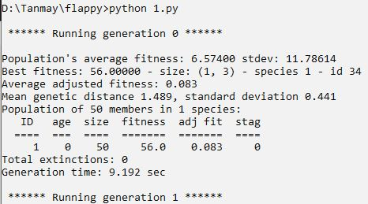

# flappy_genetic
Fappy bird using genetic algorithm

I used NEAT algorithm of genetics for this game .It's a self controlled game where only the fittest birds survive the game.  

The fittest one has the highest score out of a no of birds  
## Installation steps  
Clone the repo and install following python packages:  
pygame ,  neat ,  random ,  os,  time  

Then run python 1.py  
And you will see the following screen:  

  

  

  

  

  

